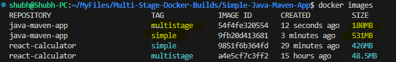
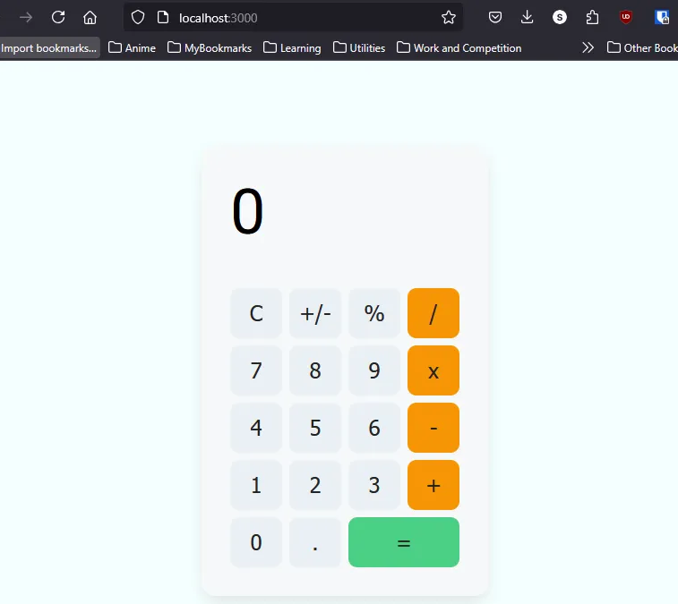

# Docker Multi-Stage Builds 🚀

## Why Use Multi-Stage Builds?
Multi-stage builds in Docker help **reduce image size**, **improve performance**, and **increase security** by eliminating unnecessary dependencies and tools from the final image.

### ✅ **Results Achieved**
By using multi-stage builds, I was able to reduce the Docker image sizes significantly:

- **ReactApp:** 🟢 **426MB → 48MB**
- **Java Maven Application:** 🔵 **531MB → 180MB**



---
## 📌 How to Build and Run the Container

### **1️⃣ React Application**
Follow these steps to build and run the React application using Docker:

#### **Step 1: Copy the Dockerfile**
Copy `dockerfile-react` into the `React-Calculator` folder.

#### **Step 2: Build the Docker Image**
```bash
cd React-Calculator
docker build -t react-calculator:multistage -f dockerfile-react .
```

#### **Step 3: Verify the Image Size**
```bash
docker images
```

#### **Step 4: Run the Container**
```bash
docker run -it -p 3000:80 --name React-Calculator react-calculator:multistage
```

#### **Step 5: Open the Application**
Once the container is running, open the app in your browser: http://localhost:3000


### **2️⃣ Java Application**
Refer the above steps for Java. After you build the Java application, run using following command
```bash
docker run --name Java-App java-maven-app:multistage
```
